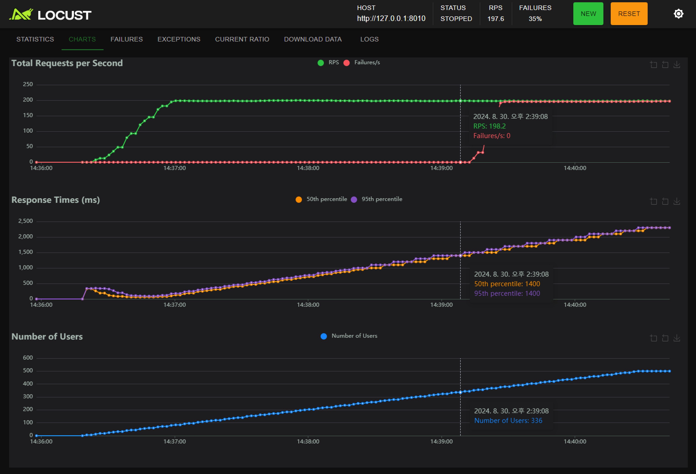
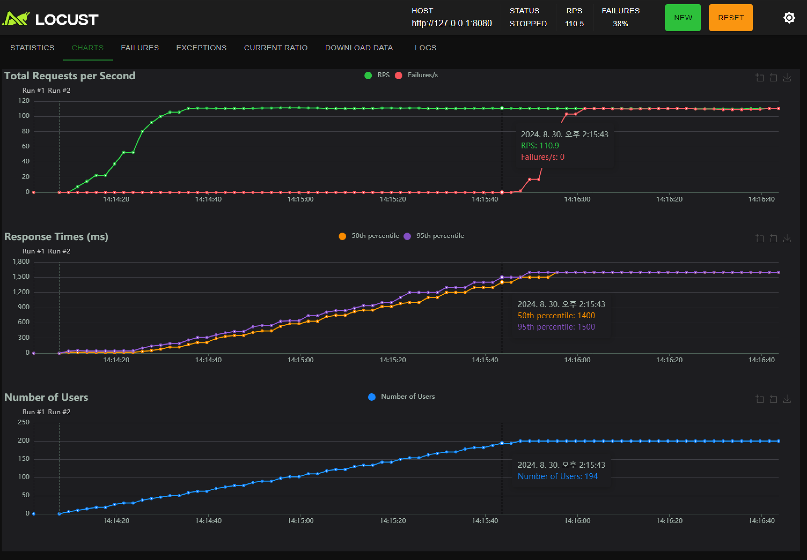
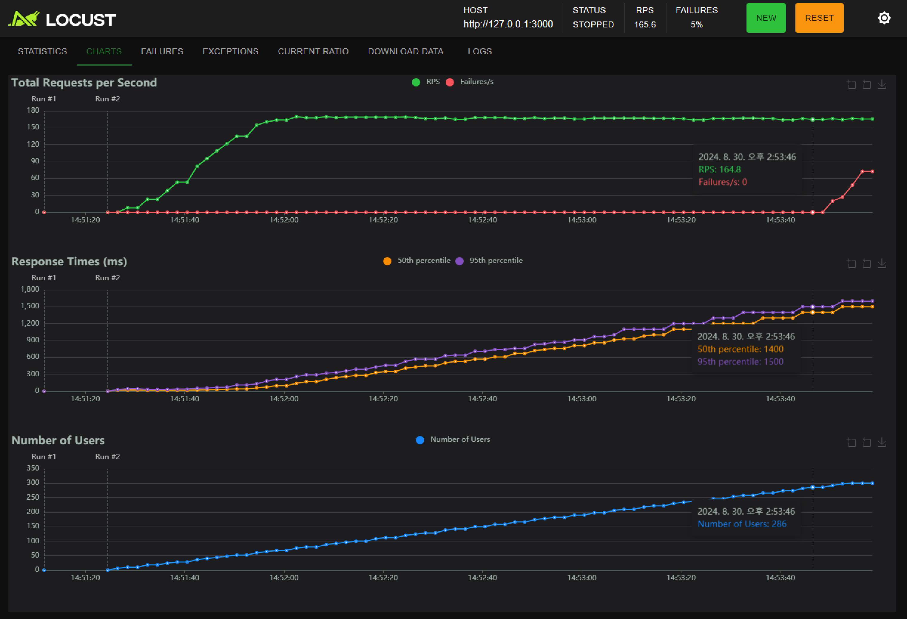

modelServingLib
----
| no | name                    | path         | status |
|---:|:------------------------|:-------------|:-------|
|  1 | Triton Inference Server | ./triton     | Done   |
|  2 | TorchServe              | ./torchserve | Done   |
|  3 | BentoML                 | ./bentoml    | Done   |

# Requirement
* python 3.11 이상
* Docker

# BenchMark
테스트 결과는 환경에 및 설정에 따라 달라질 수 있습니다.
## environment
* model: klue/roberta-base(huggingface) + pooling layer(output: 3)
* gpu: Tesla T4
* cuda 11.0
* api libs
  * bentoml==1.3.2
  * torchserve==0.11.1
  * triton
    * tritonclient==2.48.0
    * image: nvcr.io/nvidia/tritonserver:22.12-pyt-python-py3
* torch==2.0.1
* locust==2.31.2

## Summary
* 응답시간
  * 평균적인 응답시간은 __Triton__ 이 일관적으로 빠르며 Timeout 1.5s 기준으로 최대 rps 도 __Triton__ 이 가장 빠름
  * __Triton__(rps:198) < __BentoML__(rps:164) < __TorchServe__(rps:110)
    * 아래 BenchMark 참조
* 제약사항
  * __Triton__ 은 input 이나 output 이 라이브러리가 요구하는 특정 포멧을 맞춰야 하기 때문에 제약사항이 많음(내가 원하는 포멧의 아웃풋을 만들기 어려움) 
    반면 __TorchServe__, __BentoML__ 은 데이터 형식에 대해서 좀더 자유로움
* 개인적으로 느낀 개발 난이도
  * __BentoML__ < __TorchServe__ < __Triton__
  * __BentoML__ 은 ServiceClass 만 정의하면 별다른 개발이 필요 없으며 config 도 같은 파일 내에서 할 수 있기 때문에 적용하기 쉬움
  * __TorchServe__ 도 HandlerClass 만 정의하면 되지만 mar 파일을 빌드하기 위해 고려해야 할 부분이 있어 초기 설정이 쉽지 않고 직관적이지 않음
  * __Triton__, Model inference, PreProcess, PostProcess 모두 각각 별도 class 로 정의하고 이를 config.pbtxt 로 엮어야 하기 때문에 직관적 이지 않음

## Result
| server                  | result                                                                                                           |
|:------------------------|:-----------------------------------------------------------------------------------------------------------------|
| Triton Inference Server |      |
| TorchServe              |  |
| BentoML                 |     |
