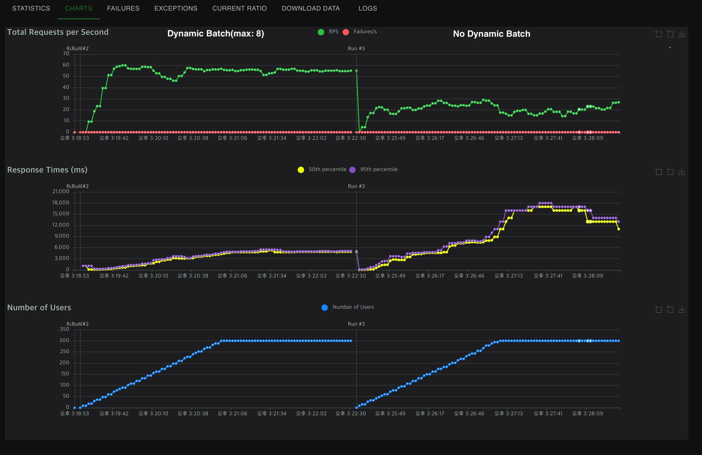

TritonServer Tutorial
---

# Step 1: Export the model
model 및 tokenizer 생성
```shell
python export.py
```

# Step 2: Set Up Triton Inference Server
## Docker Image Set Up
For install huggingface(or some other required library)
create docker image base on Nvidia TritonServer image
```shell
docker build . -t tritonserver:v1.0  
```

## Configuration Files Set Up 
configure file 셋업 방법
```text
model_repository
    L {model name}  # general model
        L config.pbtxt
        L 1                     <- 모벨 버전
            L model.pt          <- 파일명 고정 
    L {model name}  # python-backend model
        L config.pbtxt
        L 1
            L model.py          <- python-backend model define 
    L {model name}  # ensemble model
        L config.pbtxt
        L 1                     <- 파일이 없더라도 version dir 은 필요 
```

## Python-Backend Model
python-backend 모델 생성 코드 [참조](https://github.com/triton-inference-server/python_backend?tab=readme-ov-file#usage)
```python
import triton_python_backend_utils as pb_utils


class TritonPythonModel:
    """Your Python model must use the same class name. Every Python model
    that is created must have "TritonPythonModel" as the class name.
    """

    @staticmethod
    def auto_complete_config(auto_complete_model_config):
        """ [optional] """
        return auto_complete_model_config

    def initialize(self, args):
        """ [optional] called only once when the model is being loaded """
        print('Initialized...')

    def execute(self, requests):
        """ define actions """
        responses = []
        for request in requests:
            ...
        return responses
    
    def finalize(self):
        """ [optional] is called only once when the model is being unloaded """
        print('Cleaning up...')
```
**Note**   
```triton_python_backend_utils``` 은 설치 하지 않아도 docker image 안에 내장 되어 있음

## Model Ensemble
```config.pbtxt``` 파일에 ```ensemble_scheduling``` 필드에 정의
```
name: "Ensemble"
platform: "ensemble"
max_batch_size: 0

input [
    {...}
]
output [
    {...}
]
ensemble_scheduling {
    step [
        {
            model_name: "tokenizer"             <- 정의해둔 model_name
            model_version: -1                   <- 최신버전을 의미
            input_map {
                key: "input_text"               <- key 값의 이름이 실제 모델의 input 데이터 정의와 정확히 일치해야 함
                value: "input_text"
            }
            output_map [
                {...}
            ]
        },
        {...}
    ]
}
```


# Step 3: Triton Inference Server 생성
model_repository(host) 를 models(guest) 에 마운팅 하고 api를 실행
```shell
# For CPU
docker run --rm -p 8000:8000 -p 8001:8001 -p 8002:8002 \
  -v ${PWD}/model_repository:/models \
  tritonserver:v1.0 \
  tritonserver --model-repository=/models

# For CUDA
docker run --gpus all --rm -p 8000:8000 -p 8001:8001 -p 8002:8002 \
  -v ${PWD}/model_repository:/models \
  tritonserver:v1.0 \
  tritonserver --model-repository=/models
```


# Step 4: Test Api
using curl 
```shell
curl -X POST http://localhost:8000/v2/models/embedding/versions/1/infer \
   -H 'Content-Type: application/json' \
   -d '{"name": "embedding", "inputs": [{"name": "input_text", "shape": [2, 1], "datatype": "BYTES", "data": [["슈퍼 엔저 장기화에…한국 수출∙경상수지에 비상등"], ["엔저 기조 끝날까… 기나긴 하락 끝에 엔-원 환율 반등"]]}]}'

curl -X POST http://localhost:8000/v2/models/tokenizer/versions/1/infer \
   -H 'Content-Type: application/json' \
   -d '{"name": "embedding", "inputs": [{"name": "input_text", "shape": [2, 1], "datatype": "BYTES", "data": [["슈퍼 엔저 장기화에…한국 수출∙경상수지에 비상등"], ["엔저 기조 끝날까… 기나긴 하락 끝에 엔-원 환율 반등"]]}]}'
```

using client library 
```python
import tritonclient.http as httpclient
import numpy as np

text = [
    ['슈퍼 엔저 장기화에…한국 수출∙경상수지에 비상등'.encode('utf-8')],
    ['엔저 기조 끝날까… 기나긴 하락 끝에 엔-원 환율 반등'.encode('utf-8')]
]
text = np.array(text, dtype=np.bytes_)

input_text = httpclient.InferInput("input_text", list(text.shape), datatype="BYTES")
input_text.set_data_from_numpy(text, binary_data=True)

outputs = httpclient.InferRequestedOutput("output__0", binary_data=True)

client = httpclient.InferenceServerClient(url="localhost:8000")
result = client.infer(model_name='embedding', inputs=[input_text], outputs=[outputs])
print(result.as_numpy('output__0').shape)
```

# ETC
Dynamic batching 사용 전후 Throughput 비교 결과



**Note**   
model input data 사이즈가 일정하지 않으면 dynamic batching 수행을 효율적으로 할 수 없다.   
때문에 토크나이저를 사용하면서 dynamic batching 을 사용한다면 token을 고정길이로 패딩할 것을 고려해야 한다.   
단, 경우에 따라 데이터 사이즈 증가로 속도가 느려질 수 있다

```python
from typing import Dict

import numpy as np
from transformers import AutoTokenizer, TensorType

tokenizer = AutoTokenizer.from_pretrained('...')

query = ['Some text to tokenizing']
tokens: Dict[str, np.ndarray] = tokenizer(
    text=query, return_tensors=TensorType.NUMPY, padding='max_length', truncation=True, max_length=100
)
```
_고정 길이 패딩 예시_
